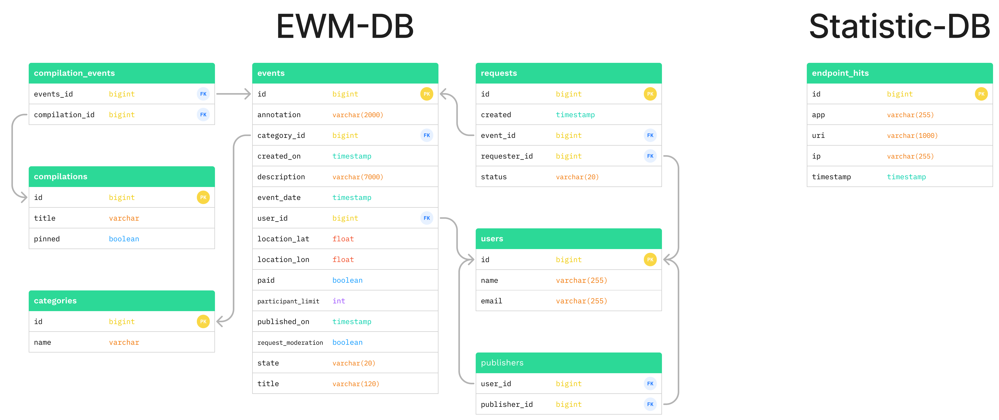

# Explore with me project
### [Pull request main <- develop](https://github.com/YuryKot/java-explore-with-me/pull/1)
##  Сервис даёт возможность делиться информацией об интересных событиях и помогает найти компанию для участия в них.

### Основные характеристики:
Сервис состоит из двух микросервисов:
1. Основной сервис — содержит всё необходимое для работы продукта.
   * API основного сервиса разделена на три части:
      * Первая — публичная, доступна без регистрации любому пользователю сети. 
      * Вторая — закрытая, доступна только авторизованным пользователям. 
      * Третья — административная, для администраторов сервиса.
2. Сервис статистики — хранит количество просмотров и позволяет делать различные выборки для анализа работы приложения.
   * Сервис статистики призван собирать информацию:
     * О количестве обращений пользователей к спискам событий.
     * О количестве запросов к подробной информации о событии.
     
Каждый микросервис обращается к своей БД:

ER-диаграмма баз данных:

Для просмотра подробной спецификации API обоих сервисов можно воспользоваться редактором [Swagger](https://editor-next.swagger.io/) файлами:
* [ewm-main-service-spec.json](ewm-main-service-spec.json)
* [ewm-stats-service-spec.json](ewm-stats-service-spec.json)

### Запуск приложения:
Для запуска приложения выполнить действия:
1. git clone [https://github.com/YuryKot/java-explore-with-me](https://github.com/YuryKot/java-explore-with-me) для скачивания репозитория
2. mvn package для создания jar файлов
3. docker-compose up для создания и развертывания четырех контейнеров, соответсвующих схеме приложения.

Запущенные контейнеры будут доступны по следующим портам:
1. 8080 - основной сервис
2. 9090 - сервис статистики
3. 6541 - БД основного сервиса
4. 6542 - БД сервиса статистики

### Дополнительная функциональность:
Добавлена возможность подписываться на других пользователей и получать список актуальных событий, опубликованных этими пользователями.

Для этого были реализованы следующие эндпоинты:
* _GET_ [/users/{userId}/publishers](/users/{userId}/publishers) - получить список пользователей, на кого подписан
* _POST_ [/users/{userId}/publishers/{publisherId}](/users/{userId}/publishers/{publisherId}) - подписаться на нового пользователя
* _DELETE_ [/users/{userId}/publishers/{publisherId}](/users/{userId}/publishers/{publisherId}) - отписаться от пользователя
* _GET_ [/users/{userId}/publishers/events](/users/{userId}/publishers/events) - получить все актуальные события пользователей, на кого подписан
* _GET_ [/users/{userId}/publishers/events/{publisherId}](/users/{userId}/publishers/events/{publisherId}) - получить актуальные события конкретного пользователя, на кого подписан